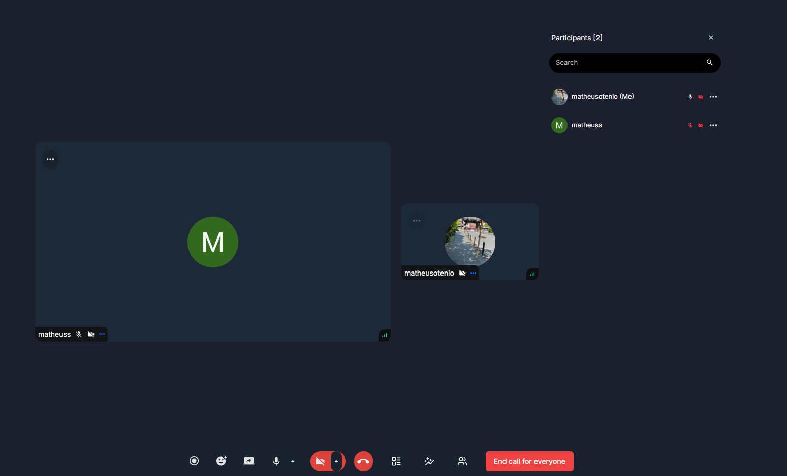

# GoogleMeet Clone

## 1. Introdução

O **GoogleMeet Clone** é uma aplicação de videoconferência que replica funcionalidades essenciais de chamadas de vídeo. Utiliza **Next.js 14, TypeScript, Tailwind CSS, Clerk e GetStream** para fornecer um sistema eficiente, responsivo e escalável.

---

## 2. Tecnologias Utilizadas

### 2.1 Frontend

- **Next.js 14**: Framework React que melhora a performance e SEO, com suporte para SSR e SSG.
- **TypeScript**: Adiciona tipagem estática ao JavaScript, reduzindo erros e facilitando a manutenção.
- **Tailwind CSS**: Framework de CSS utilitário para estilização rápida e customizável.

### 2.2 Backend e Infraestrutura

- **Clerk**: Plataforma de autenticação para gerenciamento de logins e perfis de usuários.
- **GetStream**: API para chamadas de vídeo, mensagens em tempo real e gravação de reuniões.
- **Middleware do Next.js**: Controle de acessos e segurança das requisições.

---

## 3. Funcionamento do Projeto

### 3.1 Autenticação

- Implementado com Clerk, permitindo cadastro e login seguros.

### 3.2 Criação e Gerenciamento de Reuniões

- Usuários autenticados podem criar reuniões e gerar links de acesso.
- Interface desenvolvida com React e Tailwind CSS para experiência responsiva.

### 3.3 Transmissão e Gravação de Reuniões

- API GetStream gerencia chamadas de vídeo e transmissões em tempo real.
- Suporte para gravação e armazenamento das reuniões.

### 3.4 Segurança e Controle de Acesso

- Middleware do Next.js protege requisições, permitindo acesso apenas a usuários autenticados.

---

## 4. Imagens do Projeto

### Tela de Autenticação

### Tela Inicial

### Tela de Reunião

### Tela de Gravação

### Marcar Reunião

---

## 5. Conclusão

O projeto combina **Next.js, TypeScript, Tailwind CSS e shadcn** para um frontend eficiente e responsivo. **Clerk** gerencia autenticação e usuários, enquanto **GetStream** cuida das chamadas de vídeo e gravações, garantindo uma experiência de videoconferência fluida e segura.

## 6. Referencias do Projeto

- [Instalação do shadcn no Next.js](https://ui.shadcn.com/docs/installation/next)
- [Documentação do Clerk para Next.js](https://clerk.com/docs/quickstarts/nextjs)
- [GitHub de Adrian Hajdin](https://github.com/adrianhajdin)
- [Canal JavaScript Mastery no YouTube](https://www.youtube.com/@javascriptmastery)
